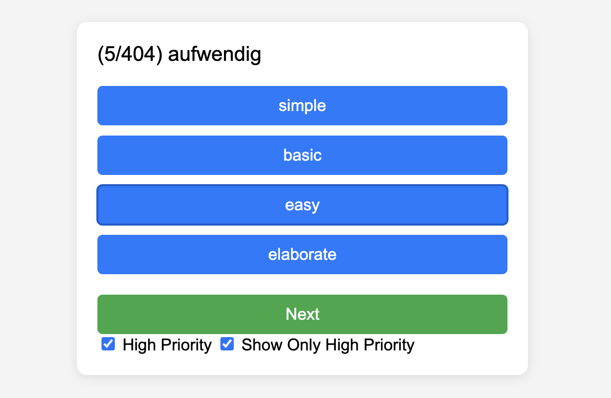

A vocabulary quiz game that runs in a web browser. Made with extensive help from ChatGPT.

It is currently set up to improve English/German language skills, but could be configured otherwise.

The game presents the user with a word and 4 possible responses. The user must choose the response that is most similar to . The "word pairs", including the correct and incorrect responses, are stored in a database and served via a Python Flask server.  It is currently set up with ~400 German words in the database:



To run:
```
python app.py
```

and navigate to http://127.0.0.1:5000 in a web browser.

`setup_db.py` can be used to create/update databases for the quiz.
